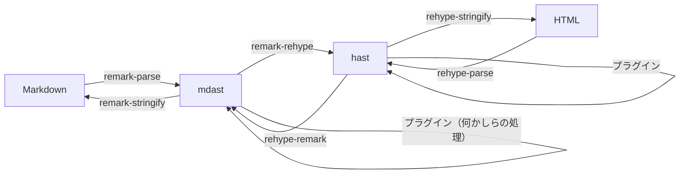

# RICORA の Web サイトを<br />作った話

<div class="absolute bottom-10 right-20">
  <span class="font-700 text-xl">
    <a href="https://r4ai.dev">Rai, 2024</a>
  </span>
</div>

---

# 軽く自己紹介


- 氏名：Rai

  - GitHub: https://github.com/r4ai
  - Web サイト: https://r4ai.dev

- 所属：情報計算科学科（IS） 学部 3 年
  - 趣味：ゲーム（FPS）、プログラミング
  - 興味：Web 開発、言語処理（コンパイラ、モデル検査、etc.）
  - 好きな言語：Rust、TypeScript

---

# 今回の話の流れ

1. 完成した Web サイト
2. GitHub を利用したチーム開発
3. 技術スタック

---
layout: iframe-right
url: https://alg.tus-ricora.com
class: border-r border-zinc-600
---

# 完成した Web サイト

- ブログ機能
- サークル紹介ページ
- メンバー一覧ページ
- お問い合わせフォーム

---

# GitHub を利用したチーム開発

- GitHub：ソフトウェアの開発プラットフォーム
  - バージョン管理、Issue、Pull Request、CI/CD などの機能を提供
  - 今日の多くのソフトウェアは、GitHub を使って開発されている
  - e.g. Node.js, Deno, Rust, TypeScript, Python, etc.
- Pull Request（PR）：コードの変更を提案する機能
  - コードの変更を提案し、レビューを受けることができる
  - レビューを受けたコードは、実際にマージされ本番環境に反映される
  - 初心者も、とにかく PR を出せば適切にレビューしてもらえるので、積極的に出そう！
- Issue：バグ報告や機能追加の提案などを行う機能
  - バグの管理や、機能追加の管理を行うことができる

---

# GitHub を使わないと...

- コードのバージョン管理が難しい
  - `最新版.xlsx`, `最新版_修正.xlsx`, `最新版_修正2.xlsx` は地獄
- チームでのコードの共有が難しい
  - Aさんの作業中に、Bさんが同じファイルを変更してしまうと、競合が発生してしまう
- CI/CD（継続的インテグレーション/デリバリー）が難しい
  - 手動でテストやビルドを行い本番環境にデプロイするのは非効率的で、ヒューマンエラーが発生しやすい

---

# 開発の流れ

1. GitHub 上で Issue を立てる  
2. Issue に対して Pull Request を出す
3. レビューを受ける
4. レビューを反映し、マージする（本番環境に反映する）

手順はマニュアル化されているので、初めての人でも簡単に開発に参加できる

参考：https://github.com/firstcontributions/first-contributions/blob/main/translations/README.ja.md

---

# Good First Issue

- 初心者向けの Issue
- 数行のコードの修正など、初心者でも取り組みやすい内容
  - 分からないことがあれば、Discord や GitHub のコメントで質問してもらえれば私が答えるので、気軽に質問してください！
- これを使って、GitHub の使い方を覚えるのも良いかもしれない
- 現時点で、8件の Good First Issue が立っている
  - https://github.com/ricora/alg.tus-ricora.com/issues?q=is%3Aissue+label%3A%22good+first+issue%22+is%3Aopen

---
layout: section
---

# 技術スタック

---

# 技術スタック

Web サイトを作るにあたって使用した技術たち

- フレームワーク：Astro, SolidJS
- コンポーネントライブラリ：Ark UI, Park UI
- スタイル：Tailwind CSS, Radix Colors
- 言語：TypeScript, MDX
- その他：
  - unified：MDXのレンダリング
  - KaTeX：数式のレンダリング
  - shiki：コードブロックのシンタックスハイライト

すべてを紹介するのは難しいので、Astro と unified について紹介する

---

# Astro について

- Astro は、静的サイトジェネレーター
  - 静的 = ビルド時に HTML が生成される
- `.astro` という独自のDSLを使う
  - HTML + TypeScript な言語

```astro {1-4|5-9}
---
// ここは TypeScript のコード。ビルド時に実行される！
const name = "Astro"
---

<!-- ここは HTML -->
<div>
  <h1>Hello {name}!</h1>  <!-- OUTPUT: <h1>Hello Astro!</h1> -->
</div>
```

---

# Astro について

- Astro の主な責務は、`.astro` から HTML を生成すること
  - クライアントで実行する JavaScript の生成についてはあまり関心がない
  - ここは React や SolidJS などの UI ライブラリに任せられる
- これは PHP ではないのか？
  - PHP は基本的にサーバーサイドで実行されるが、Astro はビルド時に実行される
  - アイランドアーキテクチャを採用したことに Astro の価値がある
- Next.js の SSG との違いは？
  - Next.js は SPA の SSR を念頭に開発しているが、Astro は MPA の SSG
    に特化しているためシンプル
  - Next.js
    は高速化のためのキャッシュなど高度な機能を多数持つが、これらのほとんどは SSG
    では必要なく、ノイズでしかない

---
layout: two-cols-header
---

# アイランドアーキテクチャとは

::left::

必要な個所でのみJavaScriptを実行しようというもの

- **海**：ページ全体を構成する静的なHTML
- **アイランド（島）**：海に浮かぶ、動的なUIコンポーネント

アイランドに対してのみJavaScriptを実行するため、ページの読み込みが高速になる

::right::


---

# unified について

- コンテンツの処理を行うエコシステム
  - e.g. Markdown から HTML を生成する
  - remark, rehype などのパッケージがある
- 用語
  - mdast: Markdown の AST
  - hast: HTML の AST



- ASTをいじるプラグインを書くことで、Markdownの拡張構文を簡単に作れる！

---

# unified について

実際に unified を使って Markdown を HTML に変換するコード

```ts {all|7-12|13-19|14|15|16|17|all} twoslash
import rehypeStringify from 'rehype-stringify'
import remarkGfm from 'remark-gfm'
import remarkParse from 'remark-parse'
import remarkRehype from 'remark-rehype'
import { unified } from 'unified'

const md = `
  # Mercury

  **Mercury** is the first planet from the [Sun](https://en.wikipedia.org/wiki/Sun).
`

const file = await unified()
  .use(remarkParse)      // Markdown -> mdast
  .use(remarkGfm)        // mdast    -> mdast
  .use(remarkRehype)     // mdast    -> hast
  .use(rehypeStringify)  // hast     -> HTML
  .process(md)

console.log(String(file))
```
---

# unified について

unified を利用した Markdown の拡張

- 今回の Web サイトでは、コールアウトやリンクカードなどの拡張構文を作成した
- この拡張構文の実装は、mdast をいじる unified のプラグインを書くことで実現した
  - 生の Markdown 文字列を扱うのに比べ、インデントや不要な半角スペースの処理などが必要ないため、楽に拡張構文を作成できる
  - Markdown ([CommonMark](https://spec.commonmark.org/0.31.2/)) では、仕様にないブロック要素はすべて [Paragraph](https://spec.commonmark.org/0.31.2/#paragraphs) として扱われるため、この [Paragraph](https://spec.commonmark.org/0.31.2/#paragraphs) に対して拡張構文を適用すればよい
  - ソースコード：https://github.com/ricora/alg.tus-ricora.com/tree/main/src/lib/remark-plugins


---

# おわりに

- GitHub 等を使ったチーム開発は、コードの品質を維持するために必要不可欠である
- Astro は、アイランドアーキテクチャを採用した静的サイトジェネレーター
- unified を使うことで、Markdown の拡張構文を簡単に作成できる

---
layout: end
---

# ご清聴ありがとうございました
